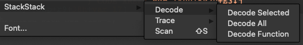
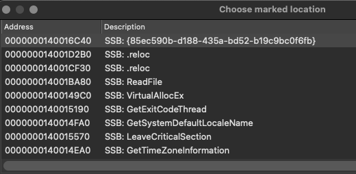

# StackStack

Simple Unicorn emulation plugin. I originally developed the plugin as a quick way to emulate decoding strings obfuscated with
[ADVObfuscator](https://github.com/andrivet/ADVobfuscator) or similar methods. 

## Installation

- Copy src/stackstack.py and src/stackstack/ to your Ida Plugins directory.
- Restart Ida

## Requirements 
 - Unicorn Emulator
 - Yara
 - Keystone engine 
 - Capstone engine 

## Configuration

- `loglevel`: Log level to use (DEBUG, ERROR, INFO...). Default: `DEBUG`
- `ext_yara_file`: External yara file to use for automated scanning. Defaults to `stackem.yara`
- `bookmarks`: Create bookmarks at decoded offsets. Default: `True`
- `rename_func`: Rename function which contains a single AdvObfuscated string. This is useful where a function 
                 encapsulates a call to a native API. Default: `False`
- `check_update`: Check if there is an update available.   

Example config file
```
{
    'loglevel': 'DEBUG',        \    
    'ext_yara_file': 'stackstack.yara',
    'bookmarks': True,
    'rename_func': False,    
    'check_update': True    
}
```


## Modes 

### Decode 

Emulates the current block or selected bytes and attempts to extract the decoded bytes.

 - Decode Selected - Emulate the selected bytes
 - Decode Current - Based on the current cursor position in the decompiler window. Detect the blocks to emulate.
   - Shortcut: `shift-x`
 - Decode All - Scan for and attempt to decode each identified block. 
 - Decode Function - Scan the current function and attempt to decode the found blocks.



### Bookmarks 
To help navigate the binary, the plugin can create a bookmark at the location of each decoded string. If this is configured, bookmarks will be created with the prefix `SSB:` 



### Trace 

For now add register values as a comment and at the end of the block emit the last val
for each register. 

### Emulate 

Emulate the current block and return the end state of all registers.

### Scan

Scan for ADVObfuscated Strings or matches based on the passed yara rules. 

Shortcut `shift-s`
